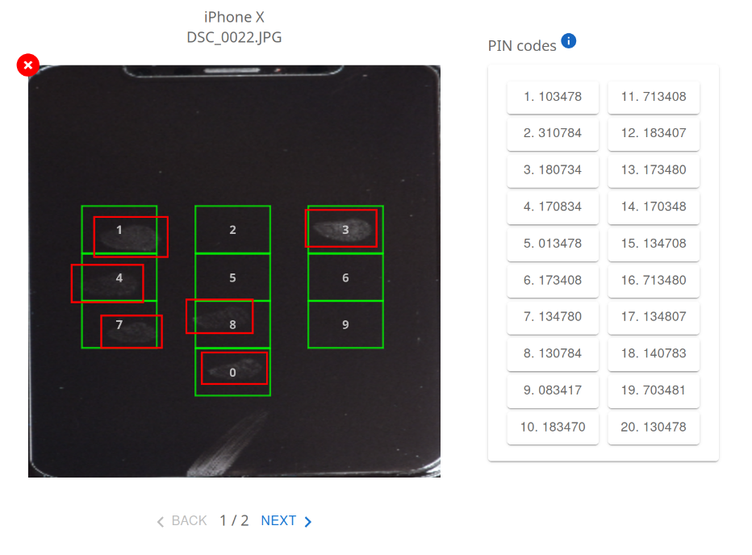

# Manuel d'utilisation

L'objectif de ce manuel est de fournir une aide quant à la configuration et à l'utilisation de
l'interface web.

## Organisation de l'interface

L'interface est divisée en deux parties principales :

**Partie gauche : Configuration et téléversement**\
Cette section permet de paramétrer l'analyse et d'importer les données nécessaires.

- Définition de la longueur du code PIN attendu (Voir la section [Prérequis à la modification de la longueur du code PIN](#modèle-de-référence) ci-après.)
- Sélection du modèle du smartphone : Cette option permet d'utiliser les boîtes de détection adaptées au clavier
  numérique du smartphone. Si le modèle n'est pas référencé dans la base de données, il peut être ajouté en important
  une image du clavier numérique vierge. Il est également possible de mettre à jour ou supprimer un modèle existant via
  l'interface. 
- Téléversement de l'image à traiter

- Configuration avancée :
    - Sélection des algorithmes permettant de définir les codes PINs les plus probables à partir de la séquence des
      chiffres inférés.
    - Ajout d'indices indiquant la présence probable d'un chiffre à une position donnée.
    - Choix entre le mode automatique ou [manuel](#mode-manuel) pour la résolution du problème de longueur de code PIN incorrect

NB : La configuration avancée s’applique uniquement à la détermination des séquences les plus probables.
Par conséquent, toutes les étapes précédant cette dernière ne seront pas exécutées,
ce qui permet un temps de réponse très rapide du serveur.

**Partie droite : Visualisation et résultats**
Cette section affiche les résultats de l'analyse :

- Visualisation de l'image importée avec les traces détectées.
- Affichage de la séquence sous-jacente représentant l'ordre des chiffres potentiels.
- Présentation des 20 codes PIN les plus probables générés par les algorithmes sélectionnés.

## Prérequis à la modification de la longueur du code PIN

Étant donné que les statistiques utilisées pour déterminer les séquences de codes PIN les plus probables sont
construites à partir d'heuristiques appliquées sur une base de données existante, toute modification de la
longueur du code PIN nécessite des statistiques adaptées à cette nouvelle longueur. Si une base de données 
correspondant à cette longueur n’existe pas encore, l’utilisateur sera invité à en ajouter une afin de permettre
la construction des nouvelles statistiques.

## Mode manuel

Lorsqu'une image est évaluée en mode manuel, il peut arriver que le nombre de traces détectées ne corresponde pas à la longueur du code PIN attendue. Dans ce cas, l’image est retournée avec les traces identifiées affichées en rouge, permettant à l’utilisateur d’intervenir pour corriger les erreurs du modèle.

L’utilisateur dispose alors de deux options pour ajuster les résultats :
1. Ajout ou modification des chiffres : 
     - L’utilisateur peut ajouter des chiffres manquants si le modèle a détecté trop peu de traces.
     - Il peut également ajouter ou modifier des répétitions pour refléter un code PIN contenant des chiffres identiques.
2. Refus des traces incorrectes
    - Si certaines traces détectées ne sont pas pertinentes, l’utilisateur peut les supprimer.

Une fois les ajustements effectués, la nouvelle séquence de touches est validée, et le processus de classement des codes PIN potentiels peut se poursuivre.
A noter que la longueur de la nouvelle séquence doit nécessairement correspondre à la longueur attendue pour la correction soit acceptée

    
    

     