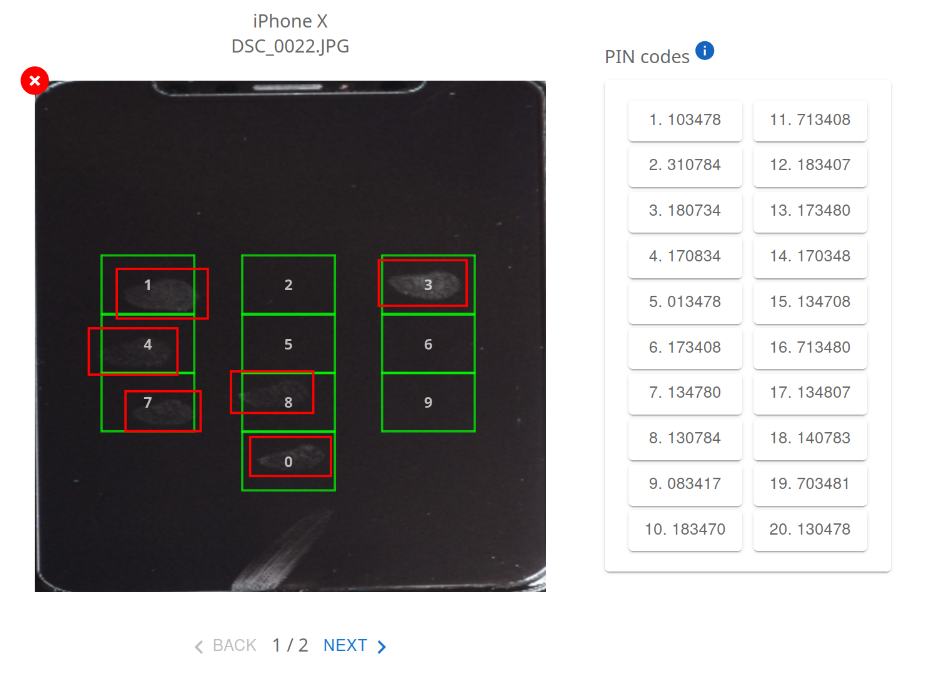

# Extraction de codes PIN à partir de traces d'utilisation  

## Introduction  

Avec l’essor des technologies mobiles, les smartphones stockent une quantité croissante d’informations sensibles, protégées par des mécanismes d’authentification comme les codes PIN et la biométrie (reconnaissance faciale, empreintes digitales, etc.). Cependant, le code PIN reste un élément central, requis après plusieurs échecs ou une période d’inactivité.  

Dans un cadre d’analyse numérique, l’accès aux appareils verrouillés représente un défi majeur. Les solutions actuelles permettant de contourner ces protections sont souvent limitées à certains modèles et nécessitent des ressources considérables en temps et en puissance de calcul.  

Ce projet vise à explorer une approche alternative basée sur l’extraction et l’analyse des traces laissées sur l’écran. L’objectif est de concevoir un algorithme capable de :  
- Identifier les traces pertinentes liées à l’authentification,  
- Détecter les superpositions indiquant des répétitions de saisie,  
- Déterminer les codes PIN les plus probables.


## Installation  

Les instructions d’installation sont disponibles dans **[INSTALL.md](INSTALL.md)**.


## Utilisation

Les détails d'utilisation de l'interface sont écrits dans [MANUAL.md](MANUAL.md)

## Pipeline de récupération du code PIN à partir des traces d'utilisation sur l'écran

1. Acquisition des données
   - Téléversement d’une photo de l’écran du téléphone éteint, contenant des traces d’utilisation.
   - Fourniture du modèle du téléphone pour récupérer la disposition du clavier numérique correspondant.
   - Indication de la longueur du code PIN attendu 
2. Normalisation de l'image
   - Correction de la perspective et alignement afin de correspondre à la disposition de référence du clavier numérique. 
3. Récupération de la séquence de chiffres du code PIN
   - Détection des traces.
   - Association des traces détectées aux touches correspondantes à l'aide de la disposition de référence.
4. Génération et classement des codes PIN potentiels
   - Génération de séquences de codes PIN probables en fonction des positions détectées et de la longueur spécifiée.
   - Classement des codes PIN potentiels en fonction des métriques sélectionnées.
5. Restitution des résultats
   - Affichage des codes PIN les plus probables, triés selon leur score de confiance.


## Fonctionnalités supplémentaires

- Modification de la longueur du code PIN attendu.
- Ajout, mise à jour et suppression de disposition du clavier numérique à la base de données
- Possibilités de donner des indices pour le code PIN : Intégration de pistes ou restrictions pouvant orienter l'analyse.
- Correction des traces inférées si le nombre de traces est incorrecte :
  - mode manuel : ajout, suppression et répétition de chiffres pour atteindre la longueur attendue ;
  - mode automatique : identification des codes PIN les plus "probables" dans l'espace étendu ou restreint formé par les nombres inférés.

NB : Les métriques permettant de définir des statistiques sur les codes PINs les plus probables en s'appuyant sur de
grands jeux de données, notamment ceux issus de la fuite de mots de passe RockYou (Bonneau et al., 2012 ; Wang et al., 2017)
ainsi que sur les codes PIN collectés anonymement via l'application iOS Big Brother Camera Security développée par Daniel Amitay (2011).
Ces datasets concernent uniquement les codes PINs à 4 et 6 chiffres.


*Exemple d'inférence (code attendu 180734)*

## Citation

```latex
@article{markert-21-unlock-pins,
    author = {Markert, Philipp and Bailey, Daniel V. and Golla, Maximilian and D\"{u}rmuth, Markus and Aviv, Adam J.},
    title = {{On the Security of Smartphone Unlock PINs}},
    journal = {ACM Transactions on Privacy and Security},
    year = {2021},
    volume = {24},
    number = {4},
    pages = {30:1--30:36},
    month = nov,
    publisher = {ACM}
}
```